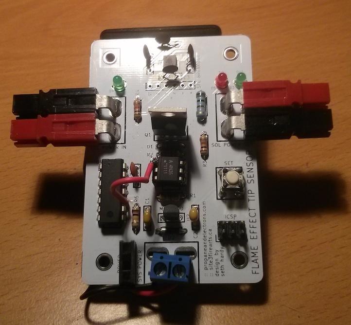

tipsensor
---------

Flame effect tip sensor for emergency power cutoff, using an ATtiny84 and ADXL335 3-axis accelerometer. Compatible with ADXL335 SparkFun breakout board if you don't want to solder surface mount parts.

To use the tip sensor, place it (at any orientation) and press the "set" button. Connect the  power input to the load power and the output to the load device (such as solenoid valve). If the sensor changes orientation, it will disable the output power and deactivate the load device.

### Feature Summary

* Uses ATtiny84 microcontroller, Arduino compatible using [Arduino-Tiny](https://code.google.com/p/arduino-tiny/)
* Powered via external battery pack
* Programmable via ICSP header
* Tip or motion sensing via ADXL335 3-axis accelerometer
* Compatible with [SparkFun ADXL335 Breakout Board](https://www.sparkfun.com/products/9269)
* Footprints for screw terminals and Anderson Powerpole connectors
* Button to set the sensor's correct position
* LED indicators for system power and load power inputs, and power output

### Documents

* [Schematic](docs/tipsensor-schematic.pdf)
* [Bill of Materials](docs/tipsensor-BOM.csv)